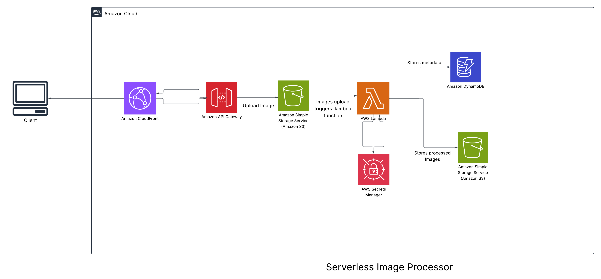

# Serverless Image Processing with S3 and Lambda

A serverless solution for automatic image processing using AWS services. This project allows users to upload images to an S3 bucket, triggering Lambda functions that process the images (resize, watermark, etc.) and store the processed versions in another S3 bucket.

**Architecture**: Serverless

## Table of Contents

- [Architecture](#architecture)
- [Features](#features)
- [Prerequisites](#prerequisites)
- [Deployment](#deployment)
- [Usage](#usage)
- [Available Image Transformations](#available-image-transformations)
- [Utility Classes](#utility-classes)
- [Customization](#customization)
- [Monitoring and Logs](#monitoring-and-logs)
- [Troubleshooting](#troubleshooting)
- [Cleanup](#cleanup)
- [Security Considerations](#security-considerations)
- [Learning Outcomes](#learning-outcomes)
- [License](#license)

## Architecture



This solution uses the following AWS services:

- **Amazon S3**: Stores both original and processed images
- **AWS Lambda**: Executes image processing when new images are uploaded
- **Amazon API Gateway**: (Optional) Provides a REST API for uploads and transformations
- **Amazon DynamoDB**: (Optional) Stores metadata about uploaded images

## Features

- **Event-driven image processing**: Automatically processes images when uploaded to S3
- **Multiple size generation**: Creates thumbnail, medium, and large sizes of each image
- **Metadata storage**: Optional DynamoDB table to track image processing details
- **REST API**: Optional API Gateway endpoints for direct upload and transformation
- **CORS support**: Configure cross-origin resource sharing for web applications
- **Serverless architecture**: No servers to manage, scales automatically


## Prerequisites

- AWS CLI installed and configured
- Node.js 14.x or later
- AWS CDK installed (`npm install -g aws-cdk`)

## Deployment

1. Clone this repository:
   ```
   git clone <repository-url>
   cd serverless-image-processing
   ```

2. Install dependencies:
   ```
   npm install
   ```

3. Build the project:
   ```
   npm run build
   ```

4. Deploy the solution:
   ```bash
   ./deployment/deploy-serverless-image-processor.sh --deploy
   ```

   During deployment, you'll be prompted for the following parameters:
   - Enable API Gateway? (Yes/No)
   - Enable CORS? (Yes/No) 
   - CORS Origin (default: *)
   - Enable DynamoDB metadata storage? (Yes/No)
   - Log retention period in days

5. Note the outputs from the deployment:
   - `SourceBucketOutput`: S3 bucket where original images should be uploaded
   - `ProcessedBucketOutput`: S3 bucket where processed images are stored
   - `ProcessedBucketURL`: URL to access processed images
   - `MetadataTableOutput`: DynamoDB table name (if enabled)
   - `ApiEndpoint`: API Gateway URL (if enabled)

## Usage

### Uploading Images via S3

1. Upload images to the `/uploads/` folder in the source bucket:
   ```
   aws s3 cp your-image.jpg s3://your-source-bucket-name/uploads/
   ```

2. The Lambda function will automatically process the image and store transformed versions in the destination bucket with the following naming format:
   - `processed/filename-thumb.jpg`: 100x100 thumbnail
   - `processed/filename-medium.jpg`: 500x500 medium size
   - `processed/filename-large.jpg`: 1024x1024 large size

### Using the API (if enabled)

#### Transform an image

```
POST /transform
Content-Type: multipart/form-data

file: <image-file>
width: 300
height: 200
```

#### Get image metadata

```
GET /info/{image-id}
```

### CloudFront Access

Access processed images through the CloudFront distribution using the following URL patterns:
- Standard: `https://{CloudFront-Domain}/image/{bucket-name}/{key}`
- With transformations: `https://{CloudFront-Domain}/image/{bucket-name}/{key}?width=300&height=300`
- Thumbor style: `https://{CloudFront-Domain}/unsafe/500x500/filters:grayscale()/image.jpg`

## Available Image Transformations

The image handler supports the following transformations:

| Transformation | Parameter | Example | Description |
|---------------|-----------|---------|-------------|
| Resize | `width`, `height` | `?width=300&height=200` | Resize the image to specified dimensions |
| Crop | `crop=true` | `?width=300&height=200&crop=true` | Crop the image to specified dimensions |
| Format | `format` | `?format=webp` | Convert image to a different format (jpg, png, webp, avif) |
| Quality | `quality` | `?quality=80` | Set the output image quality (1-100) |
| Grayscale | `grayscale=true` | `?grayscale=true` | Convert image to grayscale |
| Watermark | `watermark=true` | `?watermark=true` | Apply the configured watermark |
| Blur | `blur` | `?blur=5` | Apply Gaussian blur to the image |
| Rotate | `rotate` | `?rotate=90` | Rotate the image by specified degrees |

## Utility Classes

The solution includes several utility classes to manage AWS resources:

- **S3Operations**: Manages S3 interaction for image storage
  - `storeProcessedImage()`: Save transformed images to S3
  - `getImageMetadata()`: Retrieve image metadata from S3
  - `updateAccessStats()`: Update image access statistics

- **DbOperations**: Manages DynamoDB integration for metadata
  - `storeImageMetadata()`: Store image metadata in DynamoDB
  - `getImageMetadata()`: Retrieve image metadata
  - `updateImageMetadata()`: Update existing metadata

- **EnvConfig**: Environment configuration helper
  - `getSourceBuckets()`: Get configured source buckets
  - `getOutputBucket()`: Get processed images bucket
  - `isCacheEnabled()`: Check if caching is enabled

## Customization

### Adding Additional Transforms

To add custom image transformations, modify the `handleS3Event` function in `source/image-handler/index.ts`:

1. Add your custom transform to the `transformations` array:
   ```javascript
   const transformations = [
     { width: 100, height: 100, suffix: 'thumb' },
     { width: 500, height: 500, suffix: 'medium' },
     { width: 1024, height: 1024, suffix: 'large' },
     // Add your custom transform here
     { width: 200, height: 200, grayscale: true, suffix: 'bw' },
   ];
   ```

2. Deploy your changes:
   ```bash
   ./deployment/deploy-serverless-image-processor.sh --deploy
   ```

## Monitoring and Logs

- **CloudWatch Logs**: Monitor Lambda function execution, errors, and performance
- **CloudWatch Metrics**: Track function invocations, duration, and errors
- **DynamoDB**: Track image metadata and access statistics
- **CloudFront**: Monitor cache hit/miss metrics and content delivery performance

## Project Structure

This project is organized with the following directory structure to help contributors understand and navigate the codebase:

```
serverless-image-processing/
│
├── architecture.png              # Architecture diagram
├── README.md                     # Main project documentation
│
├── deployment/                   # Deployment-related assets
│   ├── config.env                # Configuration settings for deployment
│   ├── deploy-serverless-image-processor.sh  # Main deployment script
│   ├── manifest.json             # Deployment parameters and metadata
│   └── run-unit-tests.sh         # Script to run unit tests
│
└── source/                       # Source code
    ├── package.json              # Project dependencies
    │
    └── image-handler/            # Image handler Lambda function
        ├── image-handler.ts      # Core image processing logic
        ├── image-request.ts      # Image request handler
        ├── index.ts              # Lambda function entry point
        ├── query-param-mapper.ts # Maps query parameters to image operations
        ├── secret-provider.ts    # Manages secret retrieval
        ├── thumbor-mapper.ts     # Support for Thumbor-style URLs
        ├── upload-handler.ts     # Handles image uploads
        ├── tsconfig.json         # TypeScript configuration
        │
        ├── cloudfront-function-handlers/  # CloudFront function handler scripts
        │   ├── apig-request-modifier.js
        │   ├── ol-request-modifier.js
        │   └── ol-response-modifier.js
        │
        ├── infrastructure/       # Infrastructure as code templates
        │   ├── bucket-policy.json # S3 bucket policy template
        │   └── template.yaml     # CloudFormation/SAM template
        │
        └── lib/                  # Library & utility code
            ├── constants.ts      # Constant values
            ├── db-operations.ts  # Database operations
            ├── enums.ts          # Enumeration types
            ├── env-config.ts     # Environment configuration helpers
            ├── interfaces.ts     # TypeScript interfaces
            ├── metadata.ts       # Image metadata handling
            ├── s3-operations.ts  # S3 operations
            └── types.ts          # TypeScript type definitions
```

## How to Run the Project

Follow these steps to build, deploy, and run the serverless image processing project:

### 1. Prerequisites Setup

Ensure you have the following prerequisites installed:

```bash
# Check AWS CLI installation
aws --version

# Verify Node.js version (18.x recommended)
node --version

# Install AWS CDK globally if not installed
npm install -g aws-cdk
cdk --version

# Install TypeScript globally if needed
npm install -g typescript
tsc --version
```

### 2. Clone and Configure the Project

```bash
# Clone the repository
git clone https://github.com/sirine707/Serverless_Image_Processing_with_S3_and_Lambda.git
cd Serverless_Image_Processing_with_S3_and_Lambda

# Configure AWS credentials if not already done
aws configure
```

### 3. Install Dependencies

```bash
# Install root dependencies
npm install

# Navigate to the image-handler directory and install its dependencies
cd source/image-handler
npm install
```

### 4. Build the Project

```bash
# From the image-handler directory
npm run build

# If there's no specific build script, compile TypeScript directly
tsc -p tsconfig.json
```

### 5. Configure Deployment Parameters

Edit the configuration file to match your requirements:

```bash
# Edit the configuration file from the project root
nano deployment/config.env
```

Key parameters to consider:
- `ENABLE_DYNAMODB`: Set to "true" to enable DynamoDB metadata storage
- `ENABLE_CORS`: Set to "true" to enable CORS support
- `CORS_ORIGIN`: Configure allowed origins (default: "*")
- `MEMORY_SIZE`: Lambda memory allocation in MB (default: 1024)
- `TIMEOUT`: Lambda timeout in seconds (default: 30)
- `CACHE_CONTROL_MAX_AGE`: CloudFront cache duration in seconds

### 6. Deploy the Solution

```bash
# Navigate to the deployment directory from the project root
cd deployment

# Make the deployment script executable
chmod +x deploy-serverless-image-processor.sh

# Deploy the solution
./deploy-serverless-image-processor.sh --deploy
```

### 7. Test the Solution

After deployment is complete, note the output values and test the solution:

```bash
# Upload a test image to the source bucket
aws s3 cp path/to/test-image.jpg s3://your-source-bucket/uploads/

# List processed images in the output bucket
aws s3 ls s3://your-output-bucket/processed/

# Test the API Gateway endpoint (if enabled)
curl -X GET "https://your-api-endpoint/image/your-source-bucket/uploads/test-image.jpg?width=300&height=200"
```

### 8. Monitor Logs and Performance

```bash
# View CloudWatch logs for the Lambda function
aws logs tail /aws/lambda/image-handler-function
```

### 9. Clean Up Resources

```bash
# When finished, clean up all resources
cd deployment
./deploy-serverless-image-processor.sh --destroy
```

## Troubleshooting

### Common Issues

1. **Image Processing Failures**
   - Check CloudWatch logs for specific error messages
   - Verify that the Sharp library is correctly installed with all dependencies
   - Ensure the Lambda function has sufficient memory and timeout

2. **Access Denied Errors**
   - Verify IAM roles and policies are correctly configured
   - Check S3 bucket policies and CORS settings
   - Ensure CloudFront has proper origin access identity configured

3. **Performance Issues**
   - Increase Lambda memory allocation in `config.env`
   - Optimize image processing parameters
   - Adjust CloudFront caching behavior

## Cleanup

To remove all deployed resources, you can use the cleanup script:

```bash
./deployment/deploy-serverless-image-processor.sh --destroy
```

Or manually using the AWS Management Console or AWS CLI:

1. Delete Lambda functions:
```bash
aws lambda delete-function --function-name image-handler-function
```

2. Delete CloudWatch Log Groups:
```bash
aws logs delete-log-group --log-group-name /aws/lambda/image-handler-function
```

3. Delete S3 buckets (processed images bucket):
```bash
aws s3 rm s3://your-processed-bucket-name --recursive
aws s3 rb s3://your-processed-bucket-name
```

4. Delete IAM roles and policies:
```bash
aws iam list-roles --query "Roles[?contains(RoleName, 'image-processor')].RoleName" --output text | xargs -I {} aws iam delete-role --role-name {}
```

5. Delete API Gateway REST APIs:
```bash
# First list the APIs
aws apigateway get-rest-apis
# Then delete the specific API
aws apigateway delete-rest-api --rest-api-id <api-id>
```

6. Delete CloudFront Distribution:
```bash
# First disable the distribution (required before deletion)
aws cloudfront update-distribution --id <distribution-id> --if-match <etag> --distribution-config '{"Enabled":false}'
# Then delete it (may take time to complete)
aws cloudfront delete-distribution --id <distribution-id> --if-match <etag>
```

7. Delete DynamoDB table:
```bash
aws dynamodb delete-table --table-name image-metadata
```

**Note**: The source S3 bucket is retained by default to prevent accidental deletion of your original images. To delete it manually, use the AWS Console or AWS CLI.

## Security Considerations

### Best Practices Implemented

- **IAM Roles**: Least privilege permissions for Lambda functions and other services
- **S3 Bucket Policies**: Restrict access to authorized users and services only
- **Image URL Signing**: Optional signing of URLs for private content
- **Input Validation**: Thorough validation of all user inputs to prevent security issues
- **Encryption**: Data encryption at rest and in transit

### Additional Security Notes

- The processed image bucket allows public read access to enable serving images directly from S3
- Access to the API Gateway is not authenticated by default - add authentication as needed
- Consider adding a CloudFront distribution in front of the processed image bucket for improved performance and security

## Learning Outcomes

- Building event-driven architectures with Lambda and S3 triggers
- Understanding cost-efficient, auto-scaling serverless applications
- Enhancing security using IAM roles and S3 bucket policies

## License

Copyright Amazon.com, Inc. or its affiliates. All Rights Reserved.   
SPDX-License-Identifier: Apache-2.0